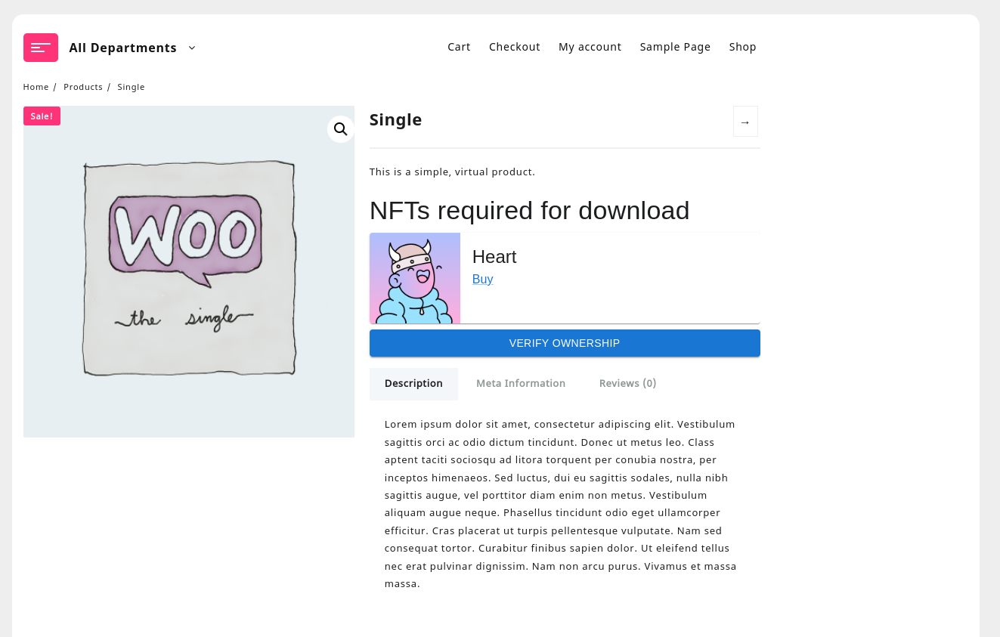

# WooCommerce NFT Downloads



WordPress plugin that makes it possible to give customers access to product downloads by checking that customers own a certain NFT. Limited documentation available in docs/.

## Setup

Run the following commands

```
nvm use
node ./scripts/setup.js
```

Start the server

```
npm run start
```

Generate zip

```
./scripts/helper.js zip
```

Note that this repository uses a fork of `@wordpress/env` so that the GMP module can be enabled.

## Testing

PHPUnit tests do not use the [wp-phpunit](https://github.com/wp-phpunit/wp-phpunit/tree/master) package. Instead, the testing framework is copied from WordPress directly into `wp-phpunit` directory. This will need manual updating.

## Tests

- `npm run test:php` PHP unit tests
- `npm run test:php:api` PHP unit tests that do remote API requests instead of using stubs
- `npm run test:e2e` E2E tests
