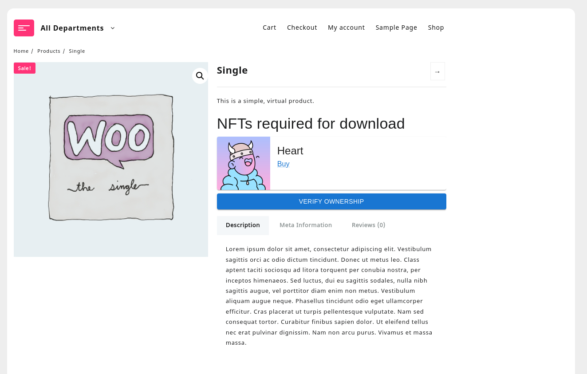

# WooCommerce NFT Downloads

## Basic setup

After installing the plugin, go to WooCommerce > Settings > Products > Downloadable products and fill in Ethereum API URL or Polygon API URL. If you do not have an Ethereum Node URL, you can use a dummy URL like `https://example.com/` or create a free node with [Alchemy](https://www.alchemy.com/).

Next, create an NFT by going to NFTs in admin menu, and adding a new NFT. You can use the following data to add a [Heart NFT](https://opensea.io/assets/0xce50f3ca1f1dbd6fa042666bc0e369565dda457d/9585).

- Token ID: 9585
- Contract address: `0xce50f3cA1F1Dbd6Fa042666bC0e369565dda457D`
- Contract type: ERC721
- Network: Ethereum
- URL: `https://opensea.io/assets/0xce50f3ca1f1dbd6fa042666bc0e369565dda457d/9585`

Navigate to an existing downloadable product or create a new one. In the product data metabox, select the Heart NFT as required for access.

Now the access to the product download will be restricted only to those users who own the Heart NFT.

## Restricting access

You can specify multiple NFTs to restrict product access. There is 1 restriction, however: all of the NFTs for 1 product must be on 1 network. So, you cannot have some NFTs on Ethereum and some NFTs on Polygon for a single product.

However, 2 different products can have NFTs from different networks.

## NFTs

ERC721 NFTs need not have the Token ID field filled in. In that case, the plugin will check that a customer owns any NFTs from a collection.
